**Graduate Students**

{: .three-col}
| [Fujiao Ji](https://fujiaoji.github.io/) | Lu Liu | [Jaehwan Park](https://sites.google.com/view/jaehwanpark/home) |
|:----------:|:------:|:------------:|
| PhD CS; 2022 - present | PhD CS; 2023 - present | PhD CS; 2024 - present |
| 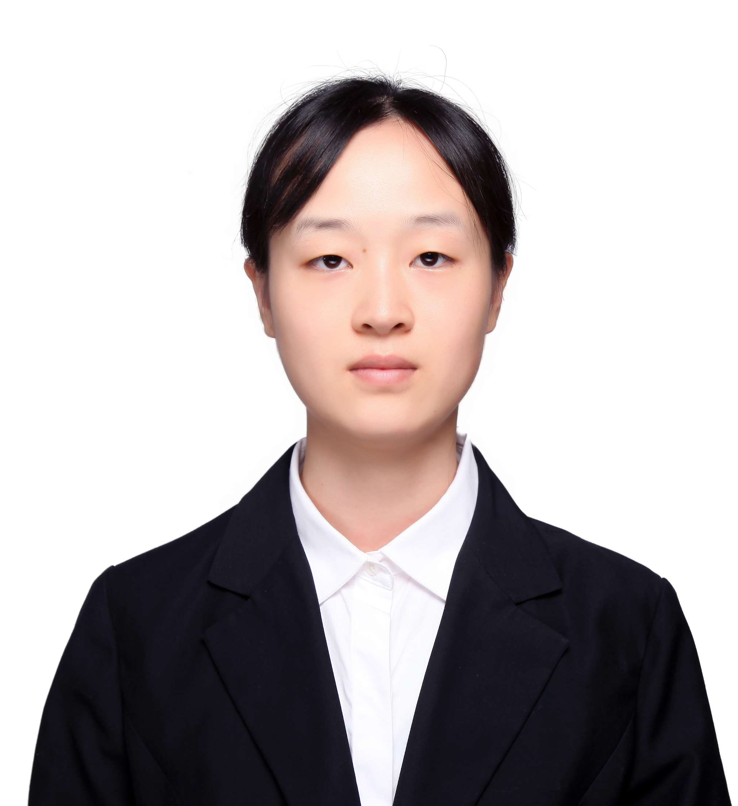 | 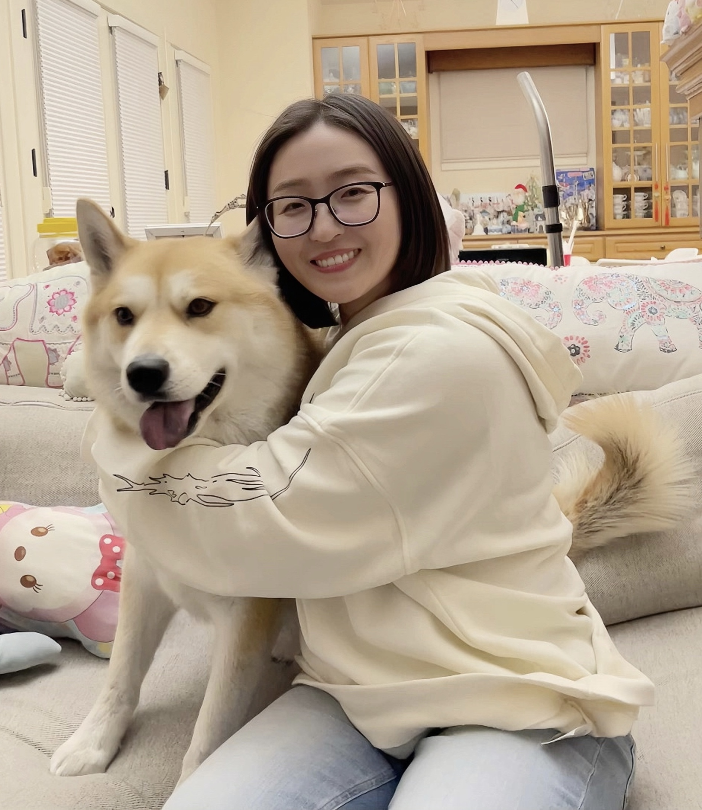 | 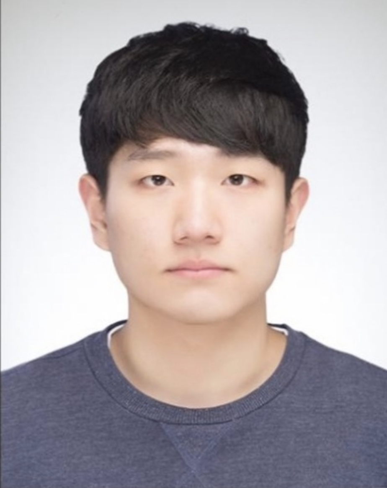 |
| [USENIX Sec'25](https://arxiv.org/pdf/2405.19598), [WWW'25 (1)](https://dl.acm.org/doi/10.1145/3696410.3714710) | | [WWW'24](https://doowon.github.io/assets/papers/2024/lim_phishing_www24.pdf), [ESORICS'25](https://doowon.github.io/assets/papers/2025/park_esorics25.pdf) |

**Previous Graduate Students**

{: .three-col}
| [Kyungchan Lim](https://kyungchanlim.github.io/) | | |
|:-------------:|:-:|:-:|
| PhD CS; 2021 - 2025 | | |
| 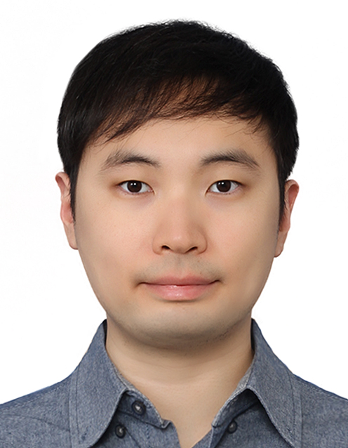 | | |
| [WISA'22](https://doowon.github.io/assets/papers/2022/lim_wisa22.pdf), [SecWeb'23](https://doowon.github.io/assets/papers/2023/lim_password23.pdf), [IMC'23](https://dl.acm.org/doi/abs/10.1145/3618257.3624804), [WWW'24](https://doowon.github.io/assets/papers/2024/lim_phishing_www24.pdf), [WWW'25 (1)](https://doowon.github.io/assets/papers/2025/lim_phishing_www25_1.pdf), [WWW'25 (2)](https://doowon.github.io/assets/papers/2025/lim_phishing_www25_2.pdf) | | |

**Visiting Scholars & Interns**  

{: .four-col}
| Seonhye Park | Kiho Lee | Mercy | Woonghee Lee |
|:------------:|:--------:|:-----:|:------------:|
| Visiting Scholar; 2025 | Visiting Scholar; 2024 | Summer Intern; 2024 | Summer Intern; 2022 |
| 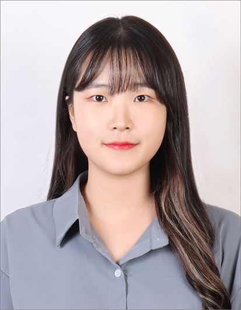 |  | 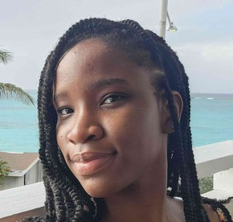 |  |

**Previous Undergraduate Students**

{: .six-col}
| Mason Hyman | Jennifer Maranville | Keith Scroggs | Emily Vo | Jackson Weil | Austin Smith |
|:-----------:|:-------------------:|:-------------:|:--------:|:------------:|:------------:|
| CS; 2023 - 2025 | CS; 2023 - 2025 | CS; 2024 - 2025 | CS; 2024 - 2025 | CS; 2024 - 2025 | CS; 2024 - 2025 |
|  | 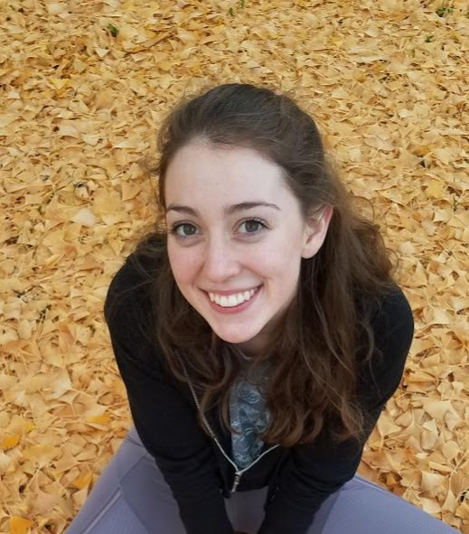 | 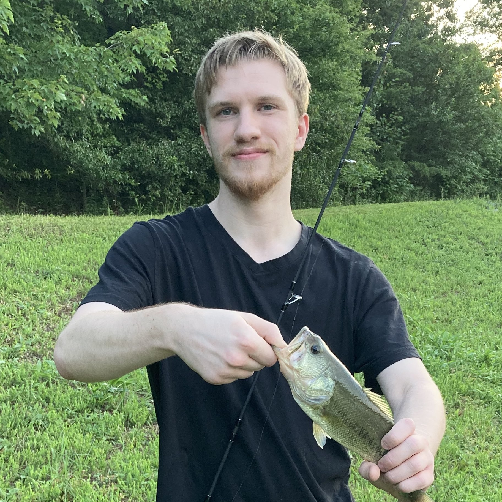 | 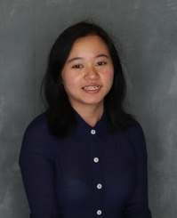 |  | 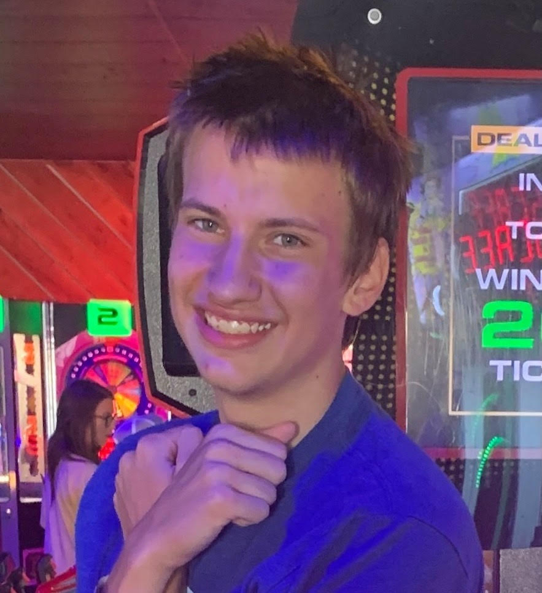 |

{: .six-col}
| Laura Smith | Sandy Fata | Makenzie Johnson | Kol Dorney | Henry Hodge | Autumn Henderson |
|:-----------:|:----------:|:----------------:|:----------:|:-----------:|:----------------:|
| CS; 2024 - 2025 | CS; 2024 - 2025 | CS; 2024 - 2025 | CS; 2024 - 2025 | CS; 2024 - 2025 | BS, 2022 |
| 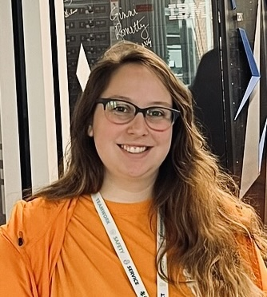 | 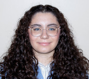 | 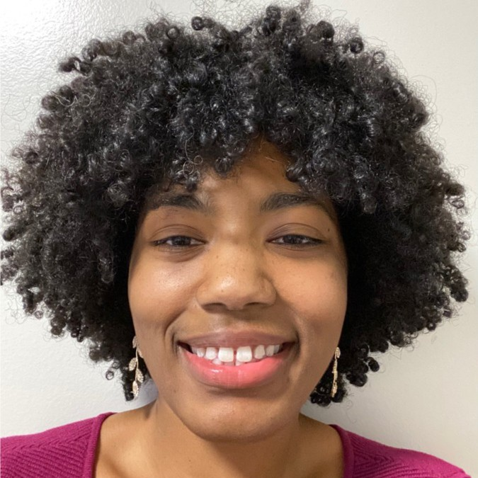 | 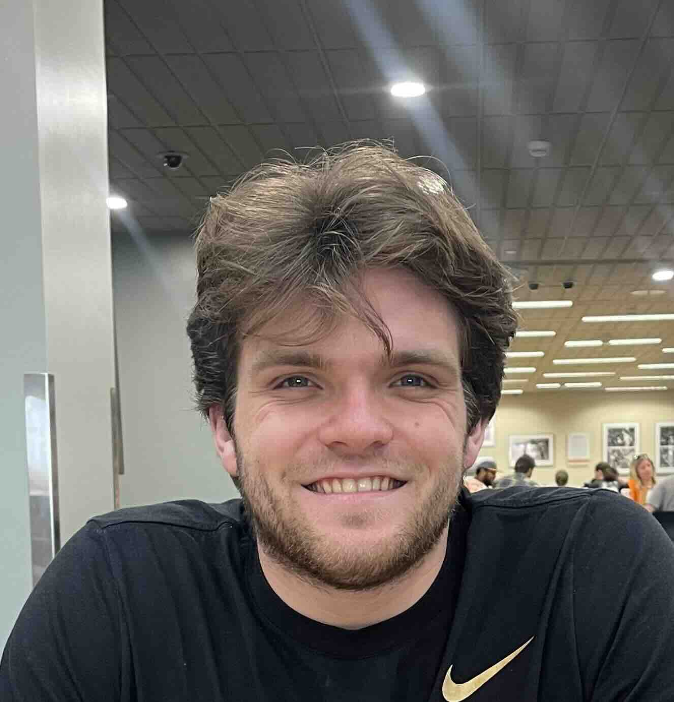 | 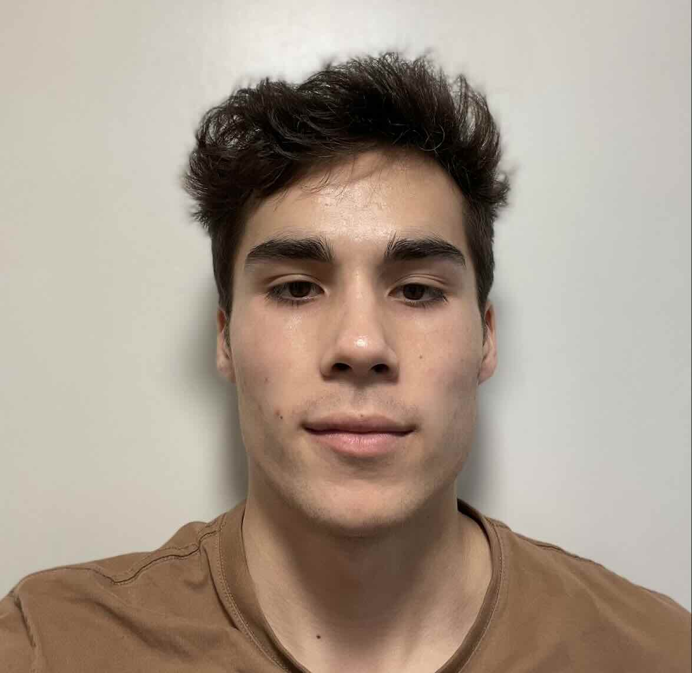 |  |
||||||| Now at Cadre5 |

{: .six-col}
| Madeline Phillips | Zachary Ables | Megan Stanton | Hunter Price | Andrei Cozma | Matt Dixson |
|:-----------------:|:--------------:|:-------------:|:------------:|:------------:|:------------:|
| MS, 2022 | BS, 2021 | BS, 2021 | BS/MS, 2023 | BS/MS, 2023 | BS/MS, 2023 |
|  |  |  |  |  |  |
| | Now at NTT Data | Now at CGI Federal | Now a Ph.D. student at UTK | Now a Ph.D. student at UTK | |

{: .six-col}
| Reed Semmel | Cole Elliott | Mike Hughes | Parker Collier | Anthony Roman |
|:-----------:|:------------:|:-----------:|:--------------:|:-------------:|
| BS, 2023 | BS, 2023 | BS, 2023 | BS/MS, 2023 | BS/MS, 2023 |
|  |  |  |  |  |
| Now at Nucor Steel | | | | |

**Committees**
- Sai Deepika Dasari (MS, 2025) -- Major Advisor
- Shreenandan Rajarathnam (PhD, in iSchool) -- PhD Thesis Committee
- Mahmoud Jahanshahi (PhD, 2025) -- PhD Thesis Committee
- Sid Ramalingam (MS, 2025) -- MS Thesis Committee
- Parker Collier (MS, 2024) -- MS Thesis Committee
- Clay Shubert (MS, 2024) 
- Nima Tayefeh (MS, 2024) -- Major Advisor
- Robert Williams (MS, 2024) -- Major Advisor
- Zachary Williams (MS, 2024) -- Major Advisor
- John Sadik (MS, 2023)
- Blake Childress (MS, 2023)
- Matt Dixson (MS, 2023) -- Major Advisor
- Ethan Partelow (MS, 2022)
- Sean Oesch (PhD, 2021)
- Austin Saporito (MS, 2021)